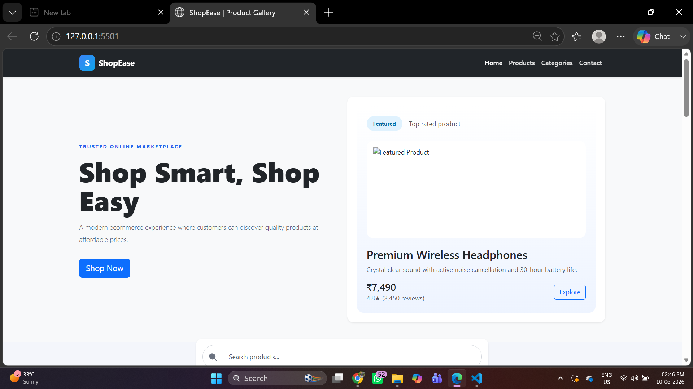
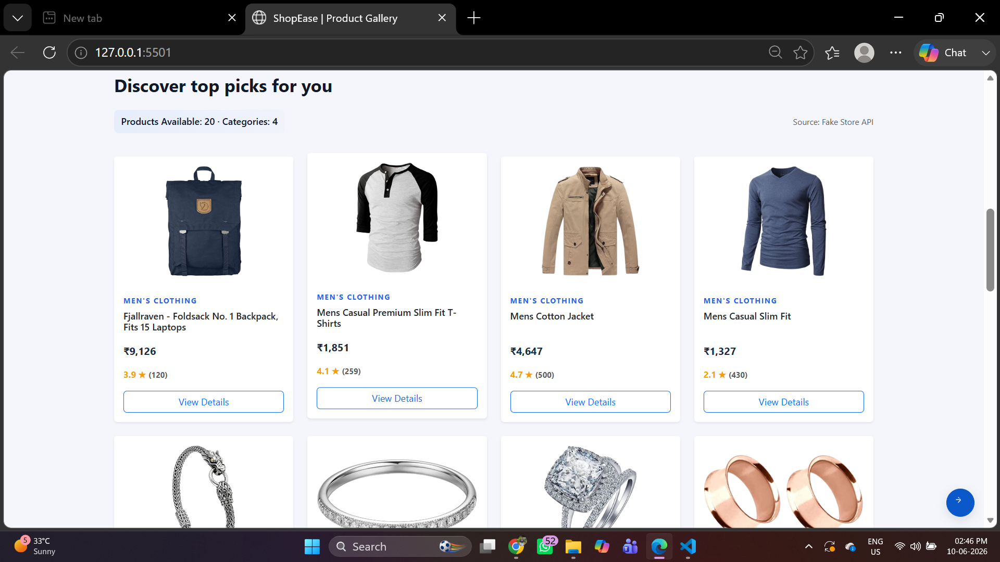
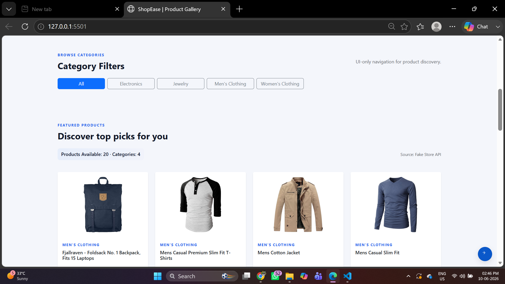
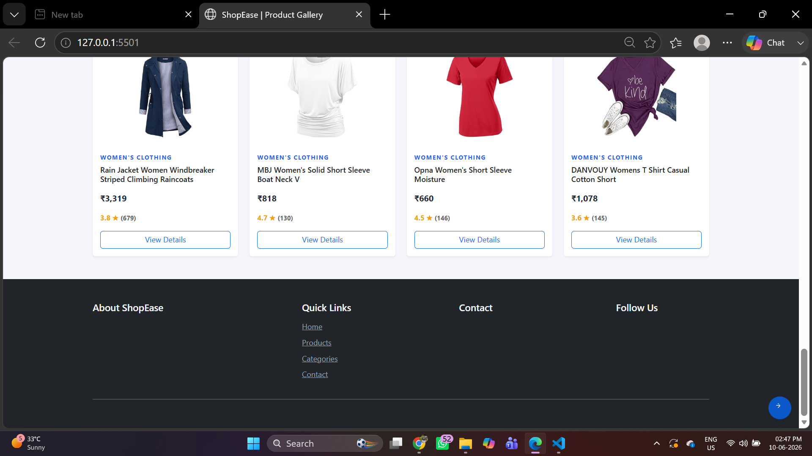

# E-Commerce Product Gallery

## Intern Information

* Full Name: Gurusha Dholwani
* Intern ID: CITS2414
* Domain: Frontend Web Development
* Duration: 4 Weeks

## Project Name
E-Commerce Product Gallery

## Project Overview
The E-Commerce Product Gallery is a responsive web application that dynamically displays products using API integration. Users can browse products, search items in real time, filter products by category, and view detailed product information through an interactive and user-friendly interface.

This project demonstrates modern frontend development concepts, including API consumption, dynamic DOM manipulation, responsive web design, accessibility, user experience optimization, and clean UI implementation.

## Project Scope
The objective of this project is to simulate a real-world e-commerce product browsing experience while demonstrating frontend development skills such as JavaScript programming, API integration, responsive web design, dynamic content rendering, and user interface development.

## Project Objectives
* Build a responsive e-commerce interface
* Fetch product data from an external API
* Implement dynamic product rendering
* Develop search and filtering functionality
* Practice JavaScript ES6+ concepts
* Improve UI/UX design skills
* Strengthen Git and GitHub workflow
* Create a portfolio-worthy frontend project

### Core Features
* Dynamic Product Listing
* Product Cards Rendering
* API Integration
* Responsive Design
* Product Categories
* Product Images
* Product Pricing 

### Advanced Features
* Real-Time Product Search
* Category-Based Filtering
* Product Details Modal
* Loading Spinner & Skeleton Loading
* Error Handling
* Responsive Navigation
* Smooth User Experience
* Empty State Handling

## Technologies Used
* HTML5
* CSS3
* Bootstrap 5
* JavaScript (ES6+)
* Fetch API
* Fake Store API
* Git
* GitHub

## Folder Structure
E-Commerce-Product-Gallery/
├── index.html
├── css/
│   └── style.css
├── js/
│   └── script.js
├── assets/
│   └── images/
├── screenshots/
├── documentation/
├── README.md
└── .gitignore

## Application Workflow
1. User opens the application.
2. Product data is fetched from the Fake Store API.
3. Loading indicators are displayed while data is being fetched.
4. Products are rendered dynamically on the page.
5. Users can search for products instantly.
6. Users can filter products by category.
7. Users can view detailed product information in a modal.
8. Statistics and product listings update dynamically.
9. The responsive layout adapts seamlessly to different screen sizes and devices.

## Screenshots

### Home Page

### Product Gallery

### Category Filters

### Product Details Modal

### Footer

## Output Images
All project output images are available in the `assets` folder:
* HOME.png
* PRODUCTS.png
* CATEGORY.png
* VIEW DETAIL.png
* FOOTER.png
These images demonstrate the major sections and functionalities of the E-Commerce Product Gallery application.

## Documentation
Project documentation is available in the documentation folder.
The documentation includes:
* Project Objective
* Features and Functionality
* Technology Stack
* Application Workflow
* Screenshots
* Implementation Details
* Conclusion

## Learning Outcomes
Through this project, I gained practical experience in:
* API Integration
* Fetch API
* Async/Await
* JSON Data Handling
* Dynamic DOM Manipulation
* Search Functionality
* Category Filtering
* Responsive Web Design
* Bootstrap Components
* Accessibility Best Practices
* Git & GitHub Workflow
* Project Documentation

## Future Enhancements
* Shopping Cart System
* Wishlist Functionality
* Product Sorting Options
* Pagination
* User Authentication
* Product Reviews & Ratings
* Dark Mode
* Backend Integration
* Payment Gateway Integration

## How to Run
1. Clone the repository.
2. Open the project folder.
3. Open `index.html` in any modern web browser.
4. Ensure an active internet connection for API requests.
5. Alternatively, run the project using VS Code Live Server for a better development experience.

## GitHub Repository
https://github.com/GD-git-17/E-Commerce-Product-Gallery

## Author
Gurusha Dholwani
Frontend Web Development Intern
GitHub: https://github.com/GD-git-17
LinkedIn: https://www.linkedin.com/in/gurusha-dholwani-81764432b
Email: [gurushadholwani@gmail.com](mailto:gurushadholwani@gmail.com)

## License
This project is created for educational, internship, and portfolio purposes.
